<div align="center">
  <a href="#"></a>
  <details>
    <summary>open this</summary>
    <a href="#"></a> <br>
    <a href="#"></a>
    <details open>
      <summary>About me</summary>
      <div align="center">
   
  ✨ Learn more about me on [priyazsh.github.io](https://priyazsh.github.io). <br>
  💌 You can reach me via email at [priyazsh@hotmail.com](mailto:priyazsh@hotmail.com).
</div>
  <a href="https://twitter.com/priyazsh" target="blank"></a>
  <a href="https://linkedin.com/in/priyazsh" target="blank"></a> 
  <a href="https://instagram.com/priyazsh" target="blank"></a>
  <a href="https://discord.com/invite/AeAjegXn6D" target="blank"></a>
      <div align="left">

```javascript
/**
 * Represents me.
 * @constructor
 * @param {string} languages - Hindi, Gujrati, English.
 * @param {string} hobbies - Cricket, Music, Gaming.
 * @param {string} interests - DiscordJS, Open Source, Javascript, Java.
 * @param {Date} birthday - 28th of May.
 */
```
  </div>
</details>


<details open>
  <summary>Discord Status</summary>
  <div>
    <a href="https://discord.com/users/838764339942785051" target="_blank">
      
    </a> <br>
  </div>
</details><details open>
  <summary>GitHub Stats</summary>

  <a href="#"></a><br>

</details>


<details open>
  <summary>Recent Activity</summary>

<!--RECENT_ACTIVITY:start-->
 [#84](https://github.com/is-a-software/is-a-software/issues/84) **|** [is-a-software/is-a-software](https://github.com/is-a-software/is-a-software)<br>
 [#84](https://github.com/is-a-software/is-a-software/issues/84) **|** [is-a-software/is-a-software](https://github.com/is-a-software/is-a-software)<br>
 [#7](https://github.com/priyazsh/priyazsh.github.io/issues/7) **|** [priyazsh/priyazsh.github.io](https://github.com/priyazsh/priyazsh.github.io)<br>
 [#7](https://github.com/priyazsh/priyazsh.github.io/issues/7) **|** [priyazsh/priyazsh.github.io](https://github.com/priyazsh/priyazsh.github.io)<br>
 [#5](undefined) **|** [priyazsh/priyazsh.github.io](https://github.com/priyazsh/priyazsh.github.io)<br>
<!--RECENT_ACTIVITY:end-->

</details>

</details>
  <a href="#"></a>
</div>
